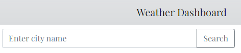
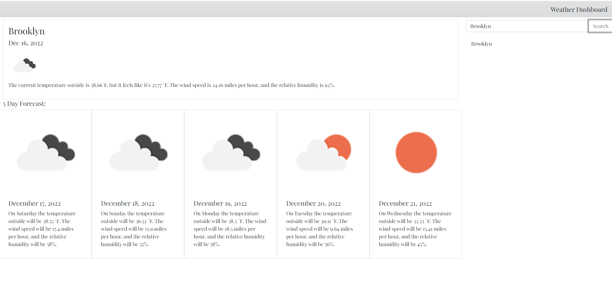
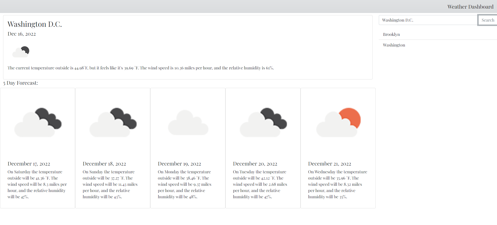
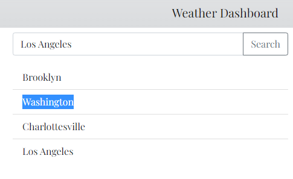

# weather-dashboard

## Description

This weather dashboard is a primitive form of a user's personal page generated using calls to the Open Weather Map's Geocoding, Current Weather Data, and  5 day / 3 hour Forecast Data APIs. The project dynamically makes calls to the APIs and prints all relevant data for users. Additionally, a user's search history is saved in such a way that it might be accessed again for later searches. 

The application is now live and may be accessed [here.](https://csanchezwagenbach.github.io/weather-dashboard/)

## Installation

No special steps required for installation. Application may be accessed on any internet browser.

## Usage

Upon loading the page, the user is with a search bar where they may input a city they would like to see the weather forecast for and save to their saved cities. Upon clicking "Search," the city will be added to their saved cities and the current weather and forecast for that searched city will print to the page. The two screenshots below represent both the waiting search area upon the page loading, and the display a user will see upon searching for a city.

If the user so desires, they may enter a new city and search. The new city will be added to the list of their searched cities, and the weather and forecast for that new city will print to the page. The screenshot below depicts what a user would see upon entering a second city and clicking "Search."

At any point, if the user navigates away from the page, when they return, their searched cities will still be displayed and print to the page. Should the user click any of the cities on the list, that city's current weather and forecast will print to the page.  A user may clear their history at any time by clearing their local storage. The screenshot below calls attention to the printed city names that may be printed so that the user may see the weather for any city in their search history.

## Credits

This project could not have been built without the teams building and maintaining the Open Weather Map APIs.

## License

MIT License

Copyright (c) 2022 Colby Sanchez Wagenbach

Permission is hereby granted, free of charge, to any person obtaining a copy
of this software and associated documentation files (the "Software"), to deal
in the Software without restriction, including without limitation the rights
to use, copy, modify, merge, publish, distribute, sublicense, and/or sell
copies of the Software, and to permit persons to whom the Software is
furnished to do so, subject to the following conditions:

The above copyright notice and this permission notice shall be included in all
copies or substantial portions of the Software.

THE SOFTWARE IS PROVIDED "AS IS", WITHOUT WARRANTY OF ANY KIND, EXPRESS OR
IMPLIED, INCLUDING BUT NOT LIMITED TO THE WARRANTIES OF MERCHANTABILITY,
FITNESS FOR A PARTICULAR PURPOSE AND NONINFRINGEMENT. IN NO EVENT SHALL THE
AUTHORS OR COPYRIGHT HOLDERS BE LIABLE FOR ANY CLAIM, DAMAGES OR OTHER
LIABILITY, WHETHER IN AN ACTION OF CONTRACT, TORT OR OTHERWISE, ARISING FROM,
OUT OF OR IN CONNECTION WITH THE SOFTWARE OR THE USE OR OTHER DEALINGS IN THE
SOFTWARE.
